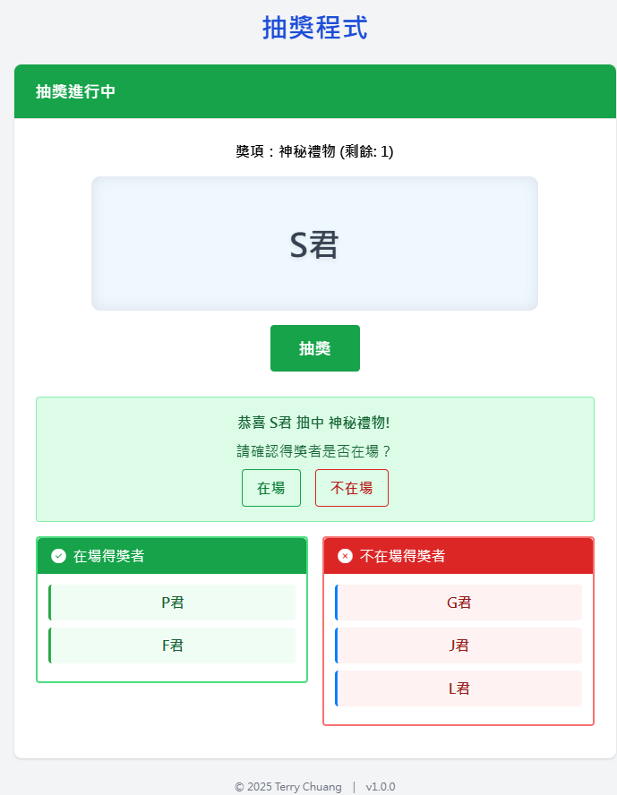

# 抽獎程式 (Lucky Draw App)

這是一個使用 HTML、CSS（Bootstrap）、JavaScript 製作的單頁式抽獎應用程式，支援 Edge 及 Chrome 瀏覽器。

## 功能特色
- 支援獎項名稱與數量輸入格式檢查
- 支援參加者名單格式檢查
- 亂數抽獎且不重複中獎
- 每抽出一位可確認是否在場，不在場可重抽並剔除
- 抽獎動畫加速與過場效果
- SPA 架構，無須額外安裝軟體
- 支援 Edge 135+、Chrome 135+

## 使用方式
1. 下載或 clone 此專案
2. 直接開啟 `index.html` 即可使用

## 執行方式

1. 下載或複製本專案到本機。
2. 使用瀏覽器開啟 `index.html` 檔案即可開始使用，無需安裝任何套件。

## 使用說明

- 於「設定抽獎」區塊輸入獎項與參加者名單。
- 點擊「開始抽獎」進入抽獎流程。
- 按下「抽獎」按鈕進行抽獎，並確認得獎者是否在場。
- 抽完所有獎項後會顯示最終中獎名單。

## 系統架構

本抽獎程式採用前端單頁式應用（SPA）設計，無需後端伺服器，所有邏輯皆於瀏覽器端執行。

### 架構圖

```
+-------------------+
|   index.html      |  <--- 主頁面，載入所有 UI 元素
+-------------------+
           |
           v
+-------------------+
|   styles.css      |  <--- 自訂樣式，輔助 Tailwind CSS 美化
+-------------------+
           |
           v
+-------------------+
|   app.js          |  <--- 主要功能腳本，處理抽獎邏輯與 UI 互動
+-------------------+
```

### 檔案說明
- `index.html`：
  - 載入 Tailwind CSS、Font Awesome、Animate.css。
  - 定義抽獎設定、抽獎流程、結果顯示等區塊。
  - 透過 `<script src="app.js">` 連結主程式。
- `styles.css`：
  - 客製化 UI 樣式與動畫。
  - 補充 Tailwind CSS 無法覆蓋的細節。
- `app.js`：
  - DOM 事件監聽與 UI 狀態切換。
  - 驗證獎項與參加者格式。
  - 控制抽獎流程、動畫、得獎者確認與結果顯示。
- `preview*.png`：
  - 執行畫面預覽圖。

### 流程簡述
1. 使用者於「設定抽獎」區塊輸入獎項與參加者名單。
2. 點擊「開始抽獎」後，進入抽獎流程。
3. 每次抽獎時，隨機選出得獎者，並確認其是否在場。
4. 抽完所有獎項後，顯示最終中獎名單與不在場名單。

## 執行結果預覽圖





## 專案結構
- `index.html`：主頁面
- `styles.css`：自訂樣式
- `app.js`：主要功能腳本

## 授權
MIT License