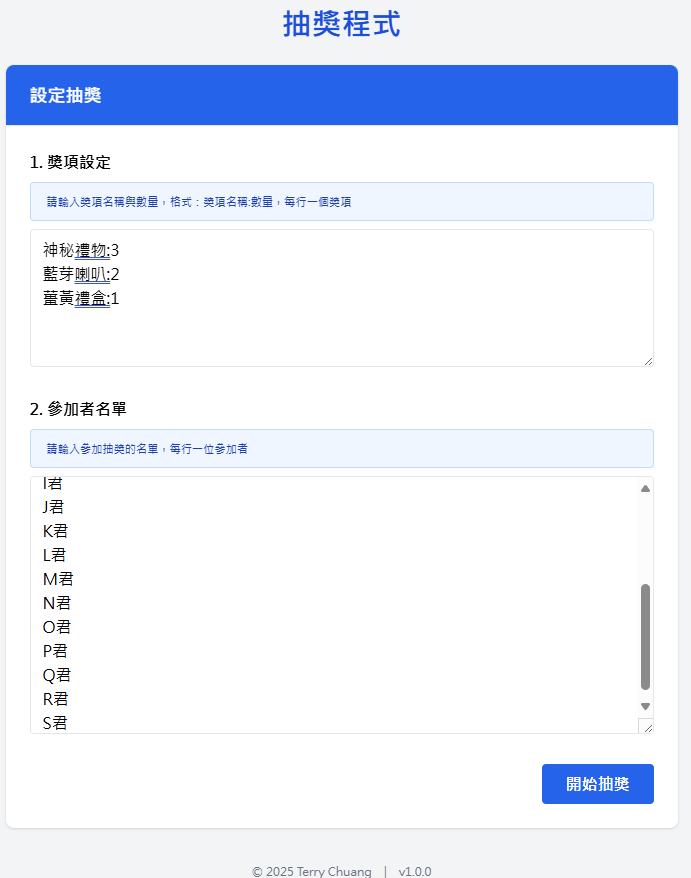

# 抽獎程式 (Lucky Draw App)

這是一個使用 HTML、CSS（Bootstrap）、JavaScript 製作的單頁式抽獎應用程式，支援 Edge 及 Chrome 瀏覽器。

## 功能特色
- 支援獎項名稱與數量輸入格式檢查
- 支援參加者名單格式檢查
- 亂數抽獎且不重複中獎
- 每抽出一位可確認是否在場，不在場可重抽並剔除
- 抽獎動畫加速與過場效果
- SPA 架構，無須額外安裝軟體
- 支援 Edge 135+、Chrome 135+

## 使用方式
1. 下載或 clone 此專案
2. 直接開啟 `index.html` 即可使用

## 執行方式

1. 下載或複製本專案到本機。
2. 使用瀏覽器開啟 `index.html` 檔案即可開始使用，無需安裝任何套件。

## 使用說明

- 於「設定抽獎」區塊輸入獎項與參加者名單。
- 點擊「開始抽獎」進入抽獎流程。
- 按下「抽獎」按鈕進行抽獎，並確認得獎者是否在場。
- 抽完所有獎項後會顯示最終中獎名單。

## 執行結果御覽圖

> 若無法顯示圖片，請確認專案資料夾內有 `preview.png` 截圖檔案。

## 專案結構
- `index.html`：主頁面
- `styles.css`：自訂樣式
- `app.js`：主要功能腳本

## 授權
MIT License